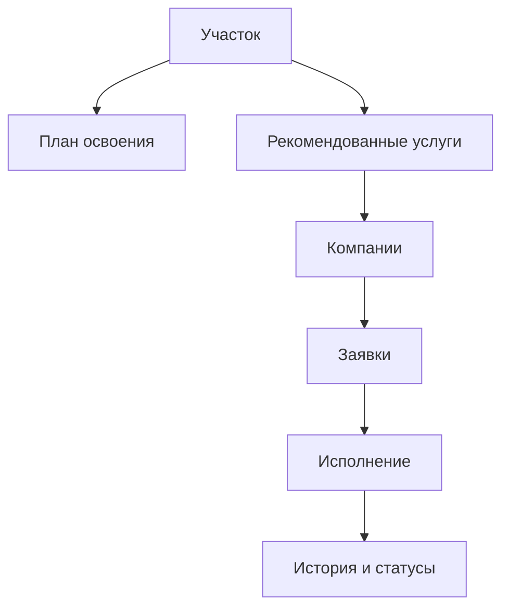
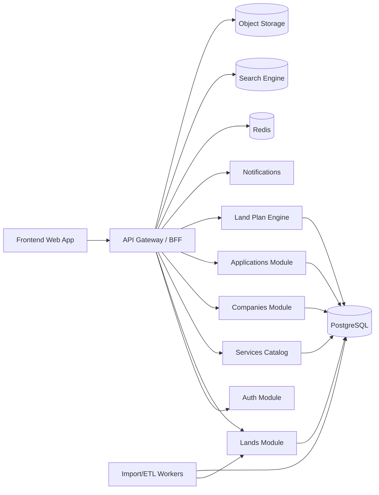

# ТЕХНИЧЕСКОЕ ЗАДАНИЕ

## Платформа подбора земельных участков и сопровождения их освоения

### Версия: CTO / Software Architect / Executive Level

---

# 1. Executive Summary

## 1.1 Что это за продукт

Проект представляет собой цифровую платформу, которая объединяет два ранее разрозненных процесса:

1. **подбор земельного участка**,
2. **подбор подрядчиков и услуг для его освоения**.

На практике пользователь не просто ищет участок на карте, а получает инструмент для прохождения полного жизненного цикла:

**поиск участка → оценка пригодности → определение необходимых работ → подбор исполнителей → оформление заявок → контроль этапов освоения**.

Таким образом, продукт должен восприниматься не как “сайт с участками” и не как “каталог подрядчиков”, а как:

> **единая операционная среда для принятия решений и запуска освоения земельного участка**.

---

## 1.2 Зачем этот продукт нужен бизнесу

Сегодня пользователь, заинтересованный в приобретении участка, сталкивается с фрагментированным рынком:

* участки ищутся в одном месте;
* юридические вопросы решаются отдельно;
* геология, вода, бурение, строительство, кадастр и проектирование ищутся вручную;
* отсутствует единый сценарий “что делать дальше”.

Это создает три проблемы:

### Для конечного пользователя

* высокая неопределенность после выбора участка;
* отсутствие понимания полного объема работ;
* сложность выбора надежных исполнителей;
* разрыв между “нашел участок” и “начал осваивать”.

### Для партнерских компаний

* нет стабильного потока квалифицированных лидов;
* отсутствует контекст заявки;
* клиент приходит “сырой”, без понимания потребности;
* нет цифрового канала встраивания в путь клиента.

### Для владельца платформы

* ограниченная монетизация, если продукт остается только витриной участков;
* низкая глубина пользовательского сценария;
* слабая удерживающая ценность;
* высокий риск коммодитизации продукта.

---

## 1.3 Ключевая бизнес-идея

Главная сила платформы в том, что она должна не просто показывать объекты, а **переводить пользователя из режима выбора в режим действия**.

После выбора участка система должна уметь отвечать на вопросы:

* Что с этим участком нужно сделать дальше?
* Какие работы обязательны, а какие рекомендованы?
* Какие компании могут выполнить эти работы в нужном регионе?
* Как собрать последовательный план освоения?
* Как отправить заявки и двигаться по этапам?

Именно эта логика превращает продукт из обычного классифайда в платформу с высокой прикладной ценностью.

---

## 1.4 Позиционирование продукта

Платформа должна быть позиционирована как:

> **цифровой помощник по выбору и освоению земельного участка**

или, в более сильной формулировке:

> **операционная система освоения земельного участка**

Это особенно важно для стратегических и нетехнических руководителей, потому что определяет не только интерфейс, но и модель бизнеса:

* монетизация не только на лидах по участкам,
* но и на лидах по услугам,
* а далее — на сопровождении сценария,
* партнерских размещениях,
* рейтингах,
* премиальном доступе,
* сделках,
* автоматизации подбора и AI-рекомендациях.

---

# 2. Видение продукта для нетехнических руководителей

## 2.1 Как продукт должен восприниматься на уровне бизнеса

Для нетехнического руководителя важно понимать, что система состоит не из “карты и фильтров”, а из трех взаимосвязанных продуктовых слоев:

### Слой 1. Выбор объекта

Пользователь находит подходящий земельный участок через карту, фильтры и карточку объекта.

### Слой 2. Понимание следующего шага

Система анализирует характеристики участка и объясняет, что необходимо сделать для его покупки, оформления и дальнейшего освоения.

### Слой 3. Подключение исполнителей

Пользователь получает доступ к релевантным подрядчикам и может сразу отправлять заявки, формируя свой план освоения.

---

## 2.2 Почему это сильнее обычного маркетплейса

Обычный каталог компаний малоценен сам по себе.
Обычная карта участков тоже имеет ограниченную ценность.
Но их связка через конкретный объект создает сильный сценарий.

Пользователь думает не категориями “найти геолога”, а категориями:

* “Я выбрал участок — что теперь делать?”
* “Какие работы обязательны?”
* “К кому обратиться?”
* “Как не ошибиться?”

Именно здесь возникает высокая продуктовая ценность, потому что система отвечает на реальную задачу пользователя, а не просто показывает справочник.

---

## 2.3 Целевой пользовательский эффект

После запуска целевой платформы пользователь должен:

* быстрее находить релевантный участок;
* лучше понимать риски и обязательные шаги;
* видеть список необходимых работ;
* получать понятные рекомендации;
* выбирать исполнителей в одном интерфейсе;
* запускать процесс освоения без хаотичного поиска подрядчиков в разных источниках.

---

## 2.4 Ценность для партнерской экосистемы

Платформа становится не просто витриной, а каналом регулярного спроса для:

* кадастровых компаний;
* геологов;
* буровых организаций;
* банков;
* юристов;
* проектировщиков;
* строительных компаний;
* компаний по ландшафту, дренажу, инженерным коммуникациям.

При этом партнеры получают не случайный лид, а пользователя, который уже находится внутри контекста конкретного участка и конкретного этапа освоения.

---

## 2.5 Стратегическая логика развития

Продукт может эволюционировать по следующей траектории:

### Этап A. Витрина и навигация

Карта, карточки участков, категории услуг, компании.

### Этап B. Транзакционная платформа

Заявки, личные кабинеты, маршрутизация лидов, рейтинги, отзывы.

### Этап C. Процессная система

План освоения участка, этапы, статусы, история действий.

### Этап D. Интеллектуальное ядро

AI-рекомендации, автогенерация следующего шага, ранжирование подрядчиков, прогноз стоимости и сроков освоения.

---

# 3. Цели проекта

## 3.1 Продуктовая цель

Создать веб-платформу, позволяющую пользователю пройти полный сценарий:

> **от выбора земельного участка до запуска работ по его освоению через релевантных подрядчиков и сервисы**

---

## 3.2 Бизнес-цели

* повысить глубину пользовательского сценария;
* увеличить ценность платформы относительно обычных агрегаторов;
* создать экосистему партнерских организаций;
* сформировать новые источники монетизации;
* подготовить основу для масштабирования в модель маркетплейса услуг вокруг земельного объекта.

---

## 3.3 Технологические цели

* перевести текущий прототип в промышлененную систему;
* реализовать backend, доменную модель и API;
* обеспечить масштабируемость данных по участкам, услугам и компаниям;
* заложить основу для AI-рекомендательной логики;
* обеспечить готовность к интеграциям с внешними источниками данных.

---

# 4. Текущее состояние (AS-IS)

## 4.1 Наличие в текущем прототипе

На данный момент в интерфейсе уже присутствуют базовые элементы пользовательского сценария:

* карта на базе Яндекс.Карт;
* фильтрация по региону, городу, цене и поисковому запросу;
* режимы источников:

  * частные объявления,
  * торги по банкротству,
  * государственные торги;
* правая панель с категориями услуг.

---

## 4.2 Проблемы текущей версии

Текущая версия является только визуальным прототипом и не обеспечивает полноценный продуктовый цикл.

Основные ограничения:

* отсутствует backend и централизованная бизнес-логика;
* нет полноценной модели пользователей и ролей;
* нет сущностей компаний и их услуг в промышленном виде;
* отсутствует логическая связка между участком и релевантными услугами;
* нет системы заявок и статусов;
* нет личных кабинетов;
* данные не управляются как единая платформа;
* отсутствует аналитический и рекомендационный слой.

---

# 5. Целевая модель (TO-BE)

## 5.1 Принцип построения системы

Центральная сущность платформы — **земельный участок**.

Все остальные элементы системы должны строиться вокруг него:

* участок как объект выбора;
* услуги как необходимые действия по его освоению;
* компании как исполнители этих услуг;
* заявки как механизм перехода к взаимодействию;
* план освоения как процессный каркас.

---

## 5.2 Концептуальная модель



---

## 5.3 Продуктовый принцип

Система должна отвечать не только на вопрос:

**“Какой участок выбрать?”**

но и на вопрос:

**“Что нужно сделать с этим участком дальше?”**

Это принципиальное отличие платформенного решения от обычного каталога.

---

# 6. Функциональная модель системы

# 6.1 Модуль участков

## 6.1.1 Назначение

Модуль участков обеспечивает поиск, просмотр, фильтрацию и анализ земельных объектов.

## 6.1.2 Основные функции

* отображение участков на карте;
* отображение в списке / каталоге;
* фильтрация по параметрам;
* открытие карточки участка;
* отображение источника и типа сделки;
* переход к сценарию освоения.

## 6.1.3 Источники данных

Система должна поддерживать несколько типов источников:

* частные объявления;
* торги по банкротству;
* государственные торги;
* в перспективе — партнерские и интеграционные источники.

## 6.1.4 Карточка участка

Карточка участка должна содержать минимум:

* уникальный идентификатор;
* координаты;
* адрес;
* кадастровые или описательные параметры;
* регион и город;
* цену;
* площадь;
* тип сделки;
* категорию земли;
* вид разрешенного использования;
* наличие / отсутствие коммуникаций;
* статус доступности;
* описание;
* фотографии / вложения;
* источник;
* дату обновления;
* признак актуальности.

## 6.1.5 Логика отображения

Для удобства работы с большим количеством объектов требуется:

* кластеризация на карте;
* lazy loading данных;
* фильтрация на стороне backend;
* ограничение плотности точек по текущей области просмотра;
* пагинация / курсорный режим для списка.

---

# 6.2 Модуль услуг

## 6.2.1 Назначение

Модуль услуг описывает набор работ и действий, которые могут потребоваться пользователю после выбора участка.

## 6.2.2 Иерархия

Базовая модель:

**Категория → Услуга → Компания**

Где:

* категория — укрупненный тип направления;
* услуга — конкретный вид работы;
* компания — исполнитель услуги.

## 6.2.3 Категории

На основе текущего интерфейса предполагаются следующие базовые категории:

* анализ воды;
* банки;
* бурение;
* геология;
* проекты домов;
* дренаж;
* ландшафт;
* кадастр;
* оценка;
* границы участка;
* перевод категории;
* проектирование;
* строительство;
* юристы.

## 6.2.4 Модель услуги

Каждая услуга должна содержать:

* id;
* category_id;
* название;
* slug;
* краткое описание;
* развернутое описание;
* обязательность / рекомендованность;
* условия применимости;
* приоритет;
* статус активности;
* SEO-метаданные;
* признаки использования в рекомендационной логике.

## 6.2.5 Бизнес-логика

Одна и та же услуга может быть:

* обязательной,
* рекомендованной,
* условной.

Например:

* кадастр обязателен, если не определены границы;
* юридическое сопровождение рекомендуется при покупке;
* геология необходима перед строительством;
* анализ воды актуален при отсутствии централизованных коммуникаций.

---

# 6.3 Модуль компаний

## 6.3.1 Назначение

Модуль компаний представляет партнерскую сеть исполнителей, способных закрывать потребности пользователя по конкретным услугам и регионам.

## 6.3.2 Карточка компании

Карточка компании должна содержать:

* id;
* юридическое и публичное название;
* описание;
* логотип;
* список услуг;
* регионы присутствия;
* контактные данные;
* рейтинг;
* отзывы;
* кейсы / портфолио;
* лицензии / документы;
* SLA / время ответа;
* режим работы;
* статусы верификации;
* признак партнера платформы;
* коммерческие условия размещения.

## 6.3.3 Логика отображения

Система должна позволять:

* фильтрацию по региону;
* фильтрацию по услуге;
* сортировку по рейтингу;
* сортировку по релевантности к участку;
* приоритизацию верифицированных партнеров;
* в будущем — ранжирование на основе поведенческих метрик и конверсии.

---

# 6.4 Связка “Участок → Услуги → Компании”

## 6.4.1 Назначение

Это ядро продукта.
Именно этот модуль обеспечивает смысловую связку между объектом недвижимости и рынком подрядчиков.

## 6.4.2 Принцип работы

После выбора участка система анализирует его параметры и формирует:

1. список обязательных действий;
2. список рекомендуемых услуг;
3. список компаний, способных закрыть эти задачи;
4. последовательность шагов пользователя.

## 6.4.3 Примеры бизнес-правил

* если отсутствует вода — предложить анализ воды, бурение, водоснабжение;
* если не определены границы — предложить кадастровые услуги;
* если планируется покупка — предложить юридическое сопровождение;
* если участок пустой и предполагается строительство — предложить проектирование, геологию, строительство;
* если категория земли не соответствует сценарию использования — предложить услуги по переводу категории или юридической оценке.

## 6.4.4 Land Plan

Система должна создавать для пользователя объект плана освоения участка, содержащий:

* ссылку на участок;
* перечень этапов;
* статус каждого этапа;
* привязанные услуги;
* выбранных исполнителей;
* отправленные заявки;
* историю изменений;
* ориентировочные сроки;
* в перспективе — бюджетный контур.

---

# 6.5 Система заявок

## 6.5.1 Назначение

Заявка — это транзакционный мост между пользователем и компанией.

## 6.5.2 Функции

* создание заявки из карточки услуги / компании / участка;
* привязка заявки к участку;
* привязка заявки к этапу плана освоения;
* передача контекста заявки исполнителю;
* отслеживание статусов;
* история коммуникаций.

## 6.5.3 Статусы заявки

Базовый набор статусов:

* pending;
* accepted;
* rejected;
* in_progress;
* completed;
* cancelled.

При необходимости возможны подстатусы:

* new;
* viewed;
* requires_clarification;
* scheduled;
* quoted;
* contract_signed.

---

# 6.6 Пользователи и роли

## 6.6.1 Основные роли

### User

Пользователь платформы, ищущий участок и подрядчиков.

### Company

Представитель компании-исполнителя.

### Admin

Администратор платформы.

### Moderator

Опциональная роль для валидации контента и компаний.

### Manager

Опциональная операционная роль для сопровождения лидов и партнеров.

## 6.6.2 Ключевые различия ролей

**User**

* ищет участки;
* сохраняет избранное;
* формирует план освоения;
* отправляет заявки;
* отслеживает статусы.

**Company**

* управляет карточкой компании;
* управляет услугами;
* получает и обрабатывает заявки;
* ведет статус работы;
* просматривает статистику.

**Admin**

* управляет справочниками;
* модерирует компании;
* модерирует услуги;
* управляет пользователями;
* работает с контентом, аналитикой и интеграциями.

---

# 6.7 Личный кабинет

## 6.7.1 Кабинет пользователя

Должен включать:

* профиль;
* избранные участки;
* сохраненные компании;
* отправленные заявки;
* статусы заявок;
* планы освоения;
* историю действий;
* уведомления.

## 6.7.2 Кабинет компании

Должен включать:

* профиль компании;
* услуги;
* входящие заявки;
* статусы обработки;
* отзывы;
* аналитику по обращениям;
* настройки уведомлений;
* документы и подтверждения.

## 6.7.3 Кабинет администратора

Должен включать:

* управление участками и источниками;
* управление компаниями и их верификацией;
* модерацию отзывов;
* управление категориями и услугами;
* просмотр системных метрик;
* аудит операций.

---

# 7. Ключевой UX-сценарий

## 7.1 Базовый пользовательский flow

1. Пользователь открывает карту.
2. Настраивает фильтры.
3. Находит интересующий участок.
4. Открывает карточку участка.
5. Система анализирует параметры объекта.
6. Пользователь получает блок “Что нужно сделать дальше”.
7. Система показывает список услуг и релевантных компаний.
8. Пользователь выбирает исполнителей.
9. Пользователь отправляет заявки.
10. Формируется персональный план освоения участка.

---

## 7.2 Что должно быть главным UX-эффектом

После просмотра участка пользователь не должен “упираться в тупик”.
Интерфейс обязан инициировать следующий шаг.

То есть карточка участка должна содержать не только описание объекта, но и смысловой блок:

> **Следующие действия по освоению участка**

Именно он должен стать ядром продуктового опыта.

---

# 8. Архитектурные требования уровня CTO / Software Architect

# 8.1 Архитектурные принципы

Система должна проектироваться как **modular monolith с четкими bounded context**, с возможностью последующего выделения сервисов без переписывания доменной логики.

Это более рационально, чем ранний переход в микросервисную архитектуру, потому что:

* продукт находится на стадии формирования;
* доменная модель еще эволюционирует;
* требуется высокая скорость изменений;
* избыточная сервисность создаст ненужную сложность.

---

## 8.2 Предлагаемые bounded contexts

1. **Identity & Access**
2. **Lands**
3. **Catalog / Services**
4. **Companies**
5. **Recommendations / Land Plan**
6. **Applications / Requests**
7. **Reviews & Ratings**
8. **Notifications**
9. **Admin & Moderation**
10. **Integrations / Data Import**

---

## 8.3 Технологический стек

### Frontend

* React или Vue как основной SPA-фреймворк;
* TypeScript;
* state management;
* интеграция с Yandex Maps API;
* SSR/SSG опционально для SEO-критичных страниц каталога.

### Backend

Рекомендуемый приоритет:

* **FastAPI** как основной backend-фреймворк
  или
* Node.js/NestJS при выборе JS/TS-центричной команды.

Для архитектуры с выраженной доменной логикой и хорошей скорости разработки предпочтителен FastAPI.

### Database

* PostgreSQL как основная транзакционная СУБД.

### Search

* Meilisearch или Elasticsearch/OpenSearch для полнотекстового и фасетного поиска.

### Cache / Async

* Redis для кэша, сессий, rate-limiting, фоновых задач.

### Background jobs

* Celery / RQ / Dramatiq / BullMQ в зависимости от backend-стека.

### Object storage

* S3-совместимое хранилище для изображений, документов и вложений.

---

# 9. Логическая архитектура

## 9.1 Компонентная схема



---

## 9.2 Почему нужен BFF / API слой

Наличие API-слоя или BFF важно для:

* унификации клиентских запросов;
* снижения перегруженности фронтенда;
* агрегации данных из нескольких доменных модулей;
* выдачи составных DTO для карточек участка и рекомендаций;
* контроля версионирования API.

---

# 10. Доменная модель

# 10.1 Основные сущности

## User

Пользователь системы.

## Company

Организация, оказывающая услуги.

## Category

Укрупненная группа услуг.

## Service

Конкретный тип работ.

## Land

Земельный участок.

## LandAttribute

Нормализованный набор свойств участка.

## LandPlan

План освоения участка.

## LandPlanStep

Шаг или этап плана.

## Application

Заявка пользователя в компанию.

## Review

Отзыв о компании.

## Source

Источник данных по участкам.

---

## 10.2 Ключевые связи

* один участок может иметь множество рекомендованных услуг;
* одна услуга может выполняться многими компаниями;
* одна компания может оказывать множество услуг;
* один пользователь может иметь множество планов освоения;
* один план освоения состоит из множества шагов;
* один шаг может быть связан с несколькими заявками;
* одна заявка принадлежит одному участку, одной услуге, одной компании и одному пользователю.

---

# 11. Физическая модель данных

## 11.1 Основные таблицы

### users

* id
* role
* email
* phone
* password_hash
* full_name
* status
* created_at
* updated_at

### user_profiles

* user_id
* avatar_url
* preferred_region
* notification_settings

### lands

* id
* external_id
* source_id
* title
* description
* address
* region_id
* city_id
* latitude
* longitude
* price
* area
* land_category
* allowed_usage
* deal_type
* status
* is_actual
* published_at
* updated_at

### land_features

* land_id
* has_water
* has_electricity
* has_gas
* has_roads
* boundaries_defined
* build_ready
* notes

### categories

* id
* name
* slug
* icon
* sort_order
* is_active

### services

* id
* category_id
* name
* slug
* short_description
* full_description
* is_required_default
* priority
* is_active

### companies

* id
* legal_name
* public_name
* description
* logo_url
* rating
* reviews_count
* verification_status
* contact_phone
* contact_email
* website
* is_active
* created_at
* updated_at

### company_regions

* id
* company_id
* region_id

### company_services

* id
* company_id
* service_id
* base_price_from
* is_active

### company_portfolio_items

* id
* company_id
* title
* description
* media_url

### applications

* id
* user_id
* land_id
* service_id
* company_id
* land_plan_id
* land_plan_step_id
* status
* message
* contact_snapshot
* created_at
* updated_at

### land_plans

* id
* user_id
* land_id
* status
* summary
* created_at
* updated_at

### land_plan_steps

* id
* land_plan_id
* service_id
* title
* description
* step_order
* priority
* status
* selected_company_id
* created_at
* updated_at

### reviews

* id
* user_id
* company_id
* rating
* text
* status
* created_at

### sources

* id
* type
* name
* config
* is_active

### notifications

* id
* user_id
* type
* payload
* status
* created_at

### audit_logs

* id
* actor_user_id
* entity_type
* entity_id
* action
* meta
* created_at

---

# 12. Recommendation Engine / Land Plan Engine

# 12.1 Почему это ядро системы

Без рекомендационного слоя проект будет восприниматься как:

* карта участков + каталог компаний.

С рекомендационным слоем проект становится:

* навигатором по освоению участка.

Это и есть стратегический дифференциатор продукта.

---

## 12.2 Базовый подход

На MVP этапе рекомендуется использовать **правила и decision engine**, а не тяжелый AI.

Причины:

* высокая интерпретируемость логики;
* быстрое внедрение;
* возможность ручной настройки;
* отсутствие необходимости в больших датасетах;
* предсказуемость поведения.

---

## 12.3 Модель правил

На вход движка поступают:

* характеристики участка;
* тип сделки;
* статус коммуникаций;
* категория земли;
* сценарий пользователя;
* сохраненные действия пользователя.

На выходе:

* список обязательных услуг;
* список рекомендованных услуг;
* приоритет этапов;
* список релевантных компаний.

---

## 12.4 Примеры правил

```text
IF has_water = false
THEN recommend [анализ воды, бурение, водоснабжение]

IF boundaries_defined = false
THEN recommend [кадастр, границы участка]

IF deal_type = purchase
THEN recommend [юрист, оценка]

IF build_ready = false AND user_goal = build_house
THEN recommend [геология, проектирование, строительство]

IF land_category incompatible with user_goal
THEN recommend [юрист, перевод категории]
```

---

## 12.5 Эволюция движка

### Фаза 1

Rule-based engine.

### Фаза 2

Скоринговая система релевантности компаний.

### Фаза 3

ML/AI-ранжирование на основе:

* конверсий,
* пользовательских действий,
* гео-контекста,
* успешности завершения этапов.

---

# 13. API-дизайн

# 13.1 Общие принципы

* REST API как базовый контракт;
* versioning через `/api/v1`;
* DTO для клиентских сценариев;
* пагинация;
* фильтрация;
* сортировка;
* идемпотентность для чувствительных операций;
* централизованная обработка ошибок.

---

## 13.2 Lands API

### GET /api/v1/lands

Получение списка участков с фильтрами.

Параметры:

* region
* city
* price_min
* price_max
* deal_type
* q
* bbox
* page / cursor
* sort

### GET /api/v1/lands/{id}

Получение карточки участка.

### GET /api/v1/lands/{id}/recommendations

Получение рекомендаций по услугам и следующим шагам.

### GET /api/v1/lands/{id}/companies

Получение списка компаний, релевантных участку.

---

## 13.3 Services API

### GET /api/v1/categories

Список категорий.

### GET /api/v1/services

Список услуг.

### GET /api/v1/services/{id}

Детали услуги.

---

## 13.4 Companies API

### GET /api/v1/companies

Список компаний.

### GET /api/v1/companies/{id}

Карточка компании.

### GET /api/v1/companies/{id}/reviews

Отзывы компании.

---

## 13.5 Land Plan API

### POST /api/v1/land-plans

Создание плана освоения по участку.

### GET /api/v1/land-plans/{id}

Получение плана.

### PATCH /api/v1/land-plans/{id}

Обновление мета-данных плана.

### PATCH /api/v1/land-plan-steps/{id}

Изменение статуса шага / выбор компании.

---

## 13.6 Applications API

### POST /api/v1/applications

Создание заявки.

### GET /api/v1/applications

Список заявок текущего пользователя / компании.

### GET /api/v1/applications/{id}

Детали заявки.

### PATCH /api/v1/applications/{id}/status

Изменение статуса.

---

## 13.7 Auth API

### POST /api/v1/auth/register

### POST /api/v1/auth/login

### POST /api/v1/auth/refresh

### POST /api/v1/auth/logout

---

# 14. Нефункциональные требования

# 14.1 Производительность

Система должна поддерживать:

* отображение до 10 000 объектов на карте через кластеризацию и серверную фильтрацию;
* быстрый отклик карточек и каталогов;
* приемлемое время ответа API при типовых запросах;
* кэширование справочников и часто запрашиваемых выборок.

---

## 14.2 Масштабируемость

Архитектура должна допускать:

* горизонтальное масштабирование API;
* вынос ETL-процессов в фоновые воркеры;
* отделение поиска в специализированный движок;
* выделение рекомендационного модуля в отдельный сервис в будущем.

---

## 14.3 Безопасность

Требуется:

* HTTPS;
* JWT / refresh tokens;
* RBAC по ролям;
* rate limiting;
* защита от SQL injection, XSS, CSRF для соответствующих контуров;
* аудит административных действий;
* безопасное хранение паролей;
* контроль доступа к заявкам и кабинетам.

---

## 14.4 Надежность

* централизованное логирование;
* мониторинг ошибок;
* health checks;
* резервное копирование БД;
* стратегия миграций;
* наблюдаемость по основным бизнес-метрикам.

---

## 14.5 SEO и индексация

Для каталожных страниц и публичных карточек компаний / услуг рекомендуется предусмотреть:

* индексируемые маршруты;
* серверный рендеринг или prerender;
* микроразметку;
* canonical;
* sitemap.

---

# 15. Интеграционный контур

## 15.1 Источники участков

Необходимо предусмотреть интеграционный слой, способный:

* импортировать данные из внешних источников;
* выполнять нормализацию схем;
* удалять дубликаты;
* обновлять актуальность записей;
* хранить source provenance.

---

## 15.2 ETL-подсистема

Фоновые процессы должны обеспечивать:

* загрузку новых участков;
* обновление существующих;
* пересчет индексов поиска;
* повторное определение рекомендаций;
* актуализацию статусов источников.

---

# 16. Администрирование и модерация

## 16.1 Админ-функции

Админ-панель должна позволять:

* управлять справочниками;
* редактировать категории и услуги;
* верифицировать компании;
* модерировать отзывы;
* управлять источниками данных;
* отслеживать системные показатели.

## 16.2 Модерация компаний

Важно реализовать статусную модель:

* draft;
* pending_review;
* verified;
* rejected;
* suspended.

Это критично для качества партнерской сети.

---

# 17. Аналитика и KPI

# 17.1 Продуктовые метрики

* количество просмотренных участков;
* конверсия из просмотра участка в открытие рекомендаций;
* конверсия из рекомендаций в выбор компании;
* конверсия из выбора компании в отправку заявки;
* количество созданных планов освоения;
* глубина прохождения этапов плана.

## 17.2 Партнерские метрики

* количество заявок по компаниям;
* среднее время ответа;
* конверсия заявки в сделку;
* рейтинг и повторные обращения.

## 17.3 Управленческие метрики

* LTV пользователя;
* доход с одного участка / сценария;
* доход на партнера;
* CAC по каналам;
* процент завершенных цепочек освоения.

---

# 18. Этапы реализации

# 18.1 MVP

Цель MVP — проверить главный сценарий:
**участок → рекомендации → компания → заявка**

В MVP должны входить:

* карта;
* участки;
* фильтры;
* карточка участка;
* каталог услуг;
* каталог компаний;
* базовые роли;
* простая система заявок;
* rule-based рекомендации;
* базовый личный кабинет пользователя.

---

## 18.2 Stage 2

* кабинет компании;
* отзывы и рейтинги;
* модерация;
* расширенный план освоения;
* аналитика;
* верификация компаний;
* улучшенный поиск.

---

## 18.3 Stage 3

* интеграции с госданными и торгами;
* продвинутые сценарии аукционов;
* расширенная транзакционная логика;
* уведомления и коммуникационный центр;
* партнерские модели размещения.

---

## 18.4 Stage 4

* AI-ранжирование подрядчиков;
* интеллектуальный подбор следующего шага;
* прогноз бюджета и сроков;
* персонализация под сценарий пользователя;
* автоматическое формирование дорожной карты освоения.

---

# 19. Риски проекта

## 19.1 Продуктовые риски

* превращение платформы в “еще один каталог”;
* отсутствие понятного next step после выбора участка;
* слабая конверсия в заявки без сильного контекста.

## 19.2 Технологические риски

* переусложнение архитектуры на старте;
* низкое качество импортируемых данных;
* проблемы с геоданными и актуальностью объектов;
* сложность нормализации внешних источников.

## 19.3 Операционные риски

* низкое качество компаний в каталоге;
* долгий отклик партнеров;
* отсутствие модерации и SLA;
* слабый контроль статусов заявок.

---

# 20. Ключевой архитектурный вывод

Если оставить продукт в виде:

* карты,
* фильтров,
* каталога подрядчиков,

то он останется интерфейсом с ограниченной ценностью.

Если же реализовать центральный контур:

> **участок → анализ → следующий шаг → услуги → компании → заявки → план освоения**

то система становится платформой с реальным продуктовым и коммерческим потенциалом.

---

# 21. Финальный вывод

Проект нужно проектировать не как доску объявлений и не как справочник компаний, а как:

> **платформу управления начальным циклом освоения земельного участка**

На уровне бизнеса это:

* усиление ценности для пользователя,
* более глубокий сценарий,
* больше точек монетизации,
* выше удержание и LTV.

На уровне архитектуры это:

* доменно-центричная система,
* API-first подход,
* модульная архитектура,
* recommendation engine как ядро,
* эволюция от MVP к интеллектуальной платформе.
